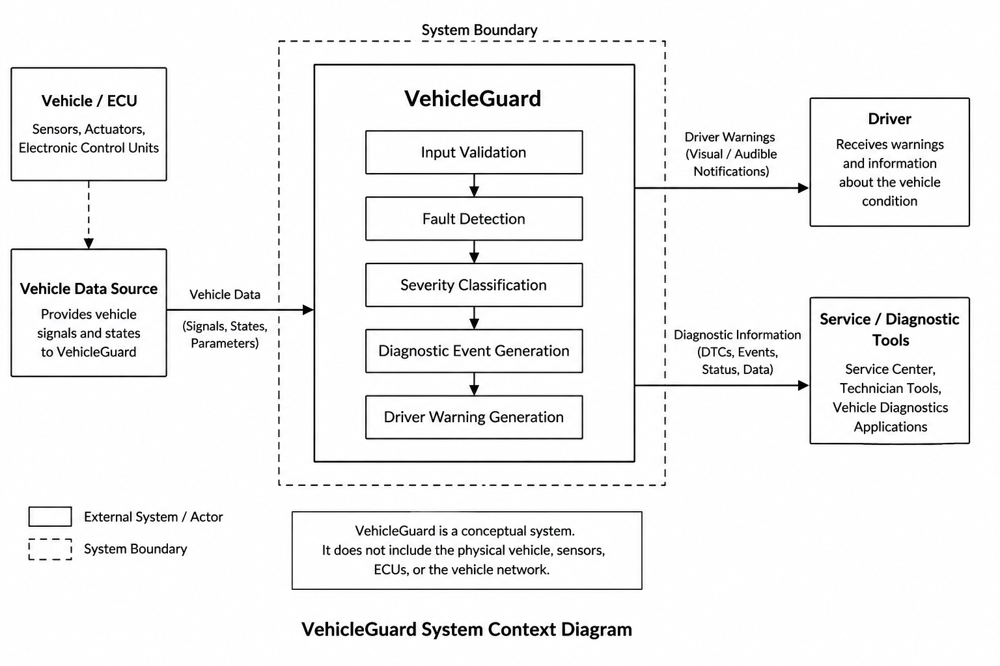
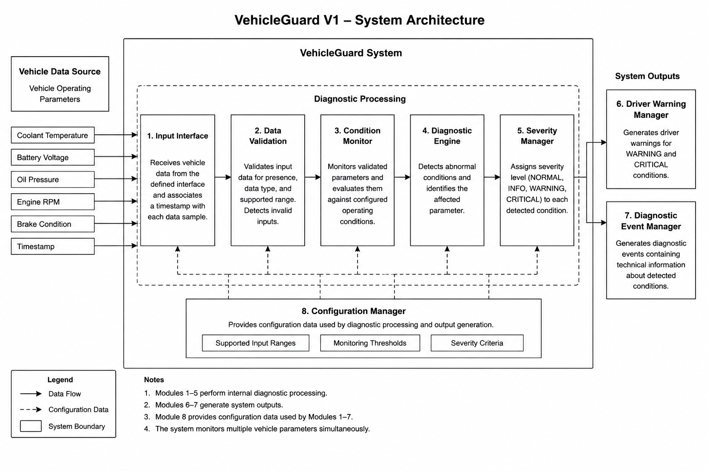
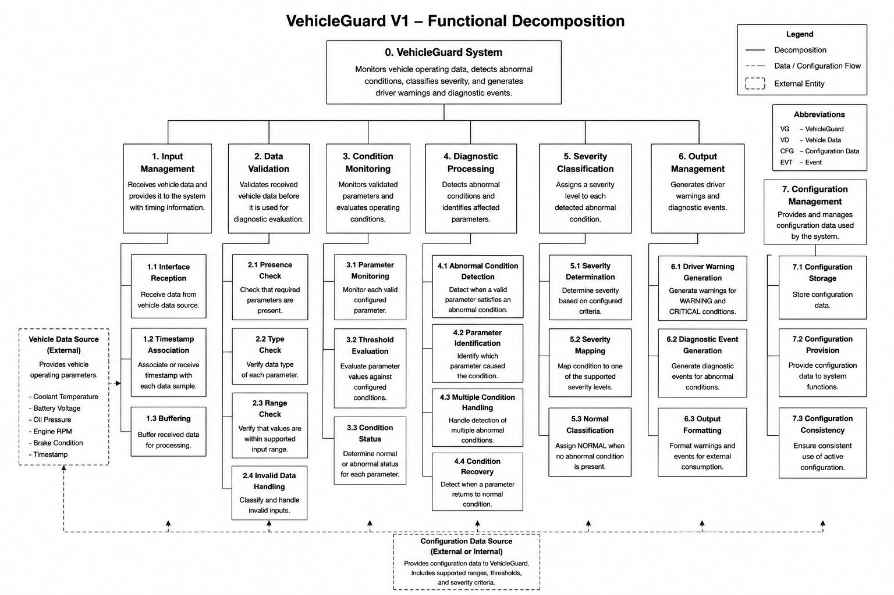
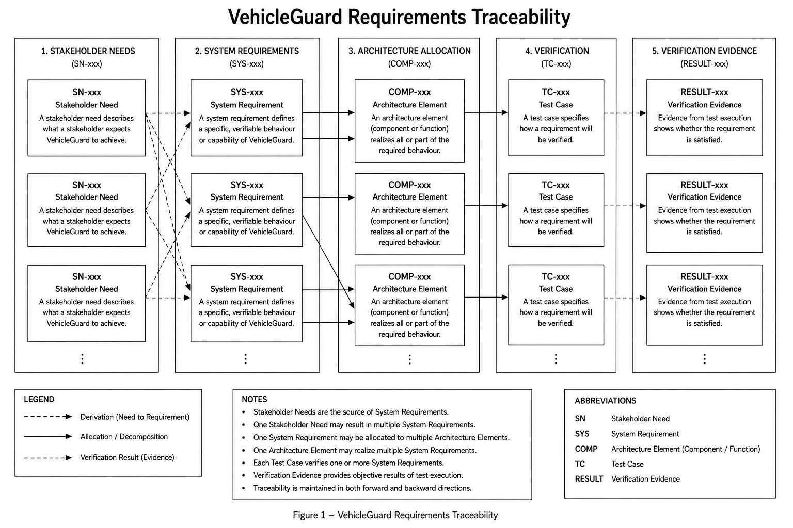

# VehicleGuard

### Automotive Systems Engineering · Vehicle Diagnostics · Requirements · Verification

> A requirements-driven automotive systems engineering case study developed from stakeholder needs and system architecture through deterministic prototype implementation and verification evidence.

**VehicleGuard V1 — Implemented and Verified**

`Python 3.14` · `95/95 Automated Tests Passed` · `46 System Requirements` · `31 Requirement-Based Test Cases`

---

## Overview

VehicleGuard is an automotive systems engineering portfolio project focused on the design and verification of a conceptual vehicle monitoring, diagnostic, and driver-warning system.

The project demonstrates an end-to-end engineering workflow:

```text
Stakeholder Needs
        ↓
System Requirements
        ↓
System Architecture
        ↓
Interface Definition
        ↓
V1 Configuration
        ↓
Prototype Implementation
        ↓
Verification
        ↓
Verification Evidence
```

VehicleGuard is not intended to represent a production ECU or a complete production vehicle diagnostic platform.

The purpose of the project is to demonstrate structured systems engineering, requirements management, architecture development, traceability, risk analysis, deterministic implementation, and verification.

---

## V1 Engineering Status

| Area | Status |
|---|---|
| Project Definition | Complete |
| Stakeholder Analysis | Complete |
| System Requirements | Complete |
| System Architecture | Complete |
| Interface Definition | Complete |
| Risk Analysis | Complete |
| V1 Configuration | Complete |
| Python Prototype | Implemented |
| Test Specification | Complete |
| Automated Verification | Passed |
| Verification Evidence | Generated |
| Requirements Verification Matrix | Verified |
| Change Management Process | Defined |

### Latest verification result

| Metric | Result |
|---|---:|
| System Requirements | 46 |
| Automated pytest Tests | 95 |
| Passed | 95 |
| Failed | 0 |
| Skipped / Blocked | 0 |
| Overall Result | **PASS** |

Verification environment:

```text
Platform: Windows
Python:   3.14.2
pytest:   9.1.1
```

---

## System Purpose

Modern vehicles continuously generate operating data from sensors, electronic control units, and communication networks.

Raw values alone are not sufficient for useful diagnostics.

A monitoring system must determine whether incoming data is valid, evaluate the operating condition of the vehicle, detect abnormal behaviour, classify the severity of detected conditions, and provide useful information to the driver or service process.

VehicleGuard V1 demonstrates this process using deterministic simulated vehicle data.

The prototype performs:

- vehicle data reception;
- input validation;
- parameter monitoring;
- diagnostic condition detection;
- severity classification;
- driver warning generation;
- diagnostic event generation;
- configuration-driven threshold evaluation;
- deterministic scenario execution;
- automated requirement-based verification.

---

## System Context



VehicleGuard operates conceptually between decoded vehicle operating data and the driver/service diagnostic domain.

The current V1 prototype does not connect to a real vehicle network. Vehicle signals are generated deterministically by the software simulator.

---

## V1 Monitored Parameters

VehicleGuard V1 intentionally uses a limited parameter set so that the complete engineering lifecycle can be developed and verified in sufficient depth.

| Parameter | Engineering Purpose |
|---|---|
| Coolant Temperature | Detection of abnormal engine thermal conditions |
| Battery Voltage | Monitoring of electrical system operating condition |
| Oil Pressure | Detection of potentially unsafe lubrication conditions |
| Engine RPM | Representation of engine operating state and contextual diagnostics |
| Brake Condition | Monitoring of braking system degradation or abnormal condition |

Diagnostic ranges, supported values, and thresholds are maintained in the controlled V1 configuration rather than being distributed arbitrarily throughout the diagnostic implementation.

---

## System Architecture



The V1 implementation follows a logical processing chain:

```text
Vehicle Data
     ↓
Input Processing
     ↓
Validation
     ↓
Monitoring
     ↓
Diagnostics
     ↓
Severity Classification
     ↓
Warning / Diagnostic Event
```

The implementation preserves separation between input handling, configuration, validation, monitoring, diagnostic evaluation, severity classification, and externally visible diagnostic outputs.

Detailed architecture information is maintained in:

`docs/04-system-architecture.md`

---

## Functional Decomposition

The VehicleGuard functionality is decomposed into engineering responsibilities rather than being treated as one monolithic diagnostic function.



The architecture defines logical elements corresponding to:

- input processing;
- validation;
- monitoring;
- diagnostics;
- severity classification;
- driver warning generation;
- diagnostic event generation;
- configuration management.

---

## Interface and Data Flow

VehicleGuard uses structured internal data representations as information moves through the diagnostic pipeline.

Important V1 structures include:

```text
VehicleData
ReceivedVehicleData
ValidatedVehicleData
ParameterCondition
DiagnosticCondition
ClassifiedCondition
DriverWarning
DiagnosticEvent
ParameterConfiguration
```

The interface flow is documented in the project architecture and interface specifications.

Detailed interface definition:

`docs/05-interfaces.md`

Supporting diagram:

`diagrams/interface-data-flow.png`

---

## Requirements Engineering

VehicleGuard is developed from defined stakeholder needs and system requirements rather than deriving requirements retrospectively from the implementation.

Each system requirement uses a stable identifier.

Examples:

```text
SYS-INP-001
SYS-VAL-001
SYS-MON-001
SYS-DIAG-001
SYS-SEV-001
SYS-WRN-001
SYS-EVT-001
SYS-CFG-001
```

The V1 baseline contains **46 system requirements** covering:

- input processing;
- validation;
- monitoring;
- diagnostics;
- severity classification;
- driver warnings;
- diagnostic events;
- configuration behaviour.

Requirements are maintained in both human-readable engineering documentation and a structured requirements workbook.

Primary artifacts:

```text
docs/03-system-requirements.md
requirements/requirements.xlsx
requirements/v1-configuration.md
```

---

## Requirements Traceability

Traceability is maintained across the engineering lifecycle.



The intended relationship is:

```text
Stakeholder Need
        ↓
System Requirement
        ↓
Architecture Element
        ↓
Implementation
        ↓
Verification Test Case
        ↓
Verification Evidence
```

This structure allows the project to answer engineering questions such as:

- Why does a requirement exist?
- Which architecture element is responsible for it?
- How is the requirement verified?
- Which test case provides verification?
- Which evidence demonstrates the result?
- What may be affected if the requirement changes?

The verification matrix is maintained in:

`requirements/requirements.xlsx`

---

## Prototype Implementation

The VehicleGuard V1 prototype is implemented in Python under:

```text
prototype/
```

Main implementation artifacts:

```text
prototype/
├── __init__.py
├── config/
│   └── vehicleguard-v1.json
├── config_loader.py
├── diagnostics.py
├── models.py
└── vehicle_simulator.py
```

The prototype uses deterministic behaviour so that verification results remain repeatable.

Diagnostic thresholds and parameter configuration are loaded from:

```text
prototype/config/vehicleguard-v1.json
```

The diagnostic implementation therefore does not independently hard-code the controlled V1 diagnostic threshold set.

---

## Running VehicleGuard

### Requirements

- Python 3.14 or compatible project environment
- pytest for automated verification

### Run the deterministic VehicleGuard simulator

```bash
python -m prototype.vehicle_simulator
```

### Run the complete automated verification suite

```bash
python -m pytest
```

Latest verified result:

```text
95 passed
0 failed
0 skipped
```

---

## Verification Strategy

VehicleGuard verification is requirement-driven.

The verification suite includes:

- normal operating conditions;
- diagnostic fault conditions;
- threshold boundary testing;
- invalid input testing;
- configuration behaviour;
- severity classification;
- driver warning behaviour;
- diagnostic event generation;
- system-level scenarios;
- regression coverage.

Parameter-specific boundary testing includes values immediately below, at, and immediately above controlled thresholds where applicable.

This is particularly important for conditions such as:

```text
x - Δ
x
x + Δ
```

where `x` represents the configured diagnostic boundary.

---

## Verification Evidence

VehicleGuard V1 verification was executed using:

```text
python -m pytest
```

Final recorded result:

```text
Tests collected: 95
Passed:          95
Failed:          0
Skipped:         0
Blocked:         0

Overall result: PASS
```

Requirement-level verification evidence uses identifiers such as:

```text
TC-DIAG-003
        ↓
RESULT-013
        ↓
PASS
        ↓
SYS-DIAG-004 VERIFIED
```

Verification artifacts are maintained in:

```text
tests/test-cases.md
tests/test-report.md
tests/results/verification-results.json
tests/results/verification-matrix-update.csv
requirements/requirements.xlsx
```

The machine-readable evidence and requirements verification matrix provide traceability between system requirements, test cases, execution results, and verification status.

---

## Risk and Failure Analysis

Risk analysis is treated as part of the engineering process rather than as an implementation afterthought.

The project considers failure scenarios including:

- invalid vehicle data;
- undetected abnormal conditions;
- incorrect severity classification;
- inappropriate driver warnings;
- configuration errors;
- diagnostic logic errors;
- interface and communication assumptions.

Supporting engineering artifacts:

```text
docs/06-risk-analysis.md
project-management/risk-register.md
diagrams/project-risk-matrix.png
diagrams/system-failure-analysis.png
```

---

## Verification and Validation Model

The project follows a requirements-to-verification engineering approach consistent with the conceptual V-model relationship between definition and verification activities.

Supporting diagram:

`diagrams/verification-v-model.png`

Detailed V&V documentation:

`docs/07-verification-validation.md`

---

## Engineering Documentation

The repository separates overview information from detailed engineering artifacts.

| Engineering Area | Primary Artifact |
|---|---|
| Project Definition | `docs/01-project-overview.md` |
| Stakeholders and Needs | `docs/02-stakeholders.md` |
| System Requirements | `docs/03-system-requirements.md` |
| System Architecture | `docs/04-system-architecture.md` |
| Interface Definition | `docs/05-interfaces.md` |
| Risk Analysis | `docs/06-risk-analysis.md` |
| Verification & Validation | `docs/07-verification-validation.md` |
| Change Management | `docs/08-change-management.md` |
| Requirements Register | `requirements/requirements.xlsx` |
| V1 Configuration | `requirements/v1-configuration.md` |
| Test Specification | `tests/test-cases.md` |
| Verification Report | `tests/test-report.md` |
| Machine-Readable Evidence | `tests/results/verification-results.json` |
| Project Roadmap | `project-management/roadmap.md` |
| Risk Register | `project-management/risk-register.md` |

---

## Engineering Diagrams

The `diagrams/` directory contains the visual engineering model set used throughout the project.

```text
diagrams/
├── functional-decomposition.png
├── interface-data-flow.png
├── project-risk-matrix.png
├── requirements-traceability.png
├── stakeholder-map.png
├── system-architecture.png
├── system-context.png
├── system-failure-analysis.png
└── verification-v-model.png
```

These diagrams cover system context, architecture, functional decomposition, interfaces, stakeholder relationships, requirements traceability, risk, failure analysis, and verification structure.

---

## Repository Structure

```text
VehicleGuard-Automotive-Systems-Engineering/
│
├── diagrams/
│   ├── functional-decomposition.png
│   ├── interface-data-flow.png
│   ├── project-risk-matrix.png
│   ├── requirements-traceability.png
│   ├── stakeholder-map.png
│   ├── system-architecture.png
│   ├── system-context.png
│   ├── system-failure-analysis.png
│   └── verification-v-model.png
│
├── docs/
│   ├── 01-project-overview.md
│   ├── 02-stakeholders.md
│   ├── 03-system-requirements.md
│   ├── 04-system-architecture.md
│   ├── 05-interfaces.md
│   ├── 06-risk-analysis.md
│   ├── 07-verification-validation.md
│   └── 08-change-management.md
│
├── project-management/
│   ├── change-requests/
│   ├── README.md
│   ├── risk-register.md
│   └── roadmap.md
│
├── prototype/
│   ├── config/
│   │   └── vehicleguard-v1.json
│   ├── __init__.py
│   ├── config_loader.py
│   ├── diagnostics.py
│   ├── models.py
│   └── vehicle_simulator.py
│
├── requirements/
│   ├── README.md
│   ├── requirements.xlsx
│   └── v1-configuration.md
│
├── tests/
│   ├── results/
│   │   ├── verification-matrix-update.csv
│   │   └── verification-results.json
│   ├── test-cases.md
│   ├── test-report.md
│   └── test_*.py
│
├── .gitignore
├── LICENSE
├── pyproject.toml
└── README.md
```

---

## Change Management

VehicleGuard uses a controlled change-management approach.

Changes affecting established V1 behaviour should be evaluated for impact on:

```text
Stakeholder Needs
        ↓
Requirements
        ↓
Architecture
        ↓
Interfaces
        ↓
Configuration
        ↓
Implementation
        ↓
Verification
```

The documented process is maintained in:

`docs/08-change-management.md`

Change-request records are maintained under:

`project-management/change-requests/`

This approach allows the verified V1 baseline to remain stable while future engineering changes can be introduced in a controlled manner.

---

## Current V1 Limitations

VehicleGuard V1 is a deterministic local engineering prototype.

It does **not** currently provide:

- connection to a real vehicle;
- production CAN communication;
- production ECU integration;
- AUTOSAR implementation;
- safety-certified hardware;
- production diagnostic infrastructure;
- cloud services;
- database infrastructure;
- production driver HMI;
- functional safety certification;
- cybersecurity certification;
- homologation;
- a production safety claim.

The current implementation must therefore not be interpreted as production automotive software.

---

## Future Engineering Extensions

Potential future development may include:

- simulated CAN communication;
- diagnostic trouble code handling;
- communication timeout monitoring;
- additional signal plausibility checks;
- additional vehicle parameters;
- fault history;
- battery health estimation;
- maintenance prediction;
- diagnostic report generation;
- driver or service diagnostic interfaces;
- simplified FMEA;
- automated requirements-to-test traceability tooling;
- Automotive SPICE-inspired engineering artifacts;
- conceptual ISO 26262 analysis.

These features are intentionally outside the committed VehicleGuard V1 baseline.

Any extension affecting established V1 behaviour should be introduced through the documented change-management process.

---

## Engineering Principles

VehicleGuard is developed around several principles:

**Requirements before implementation**  
Important system behaviour should be defined before implementation.

**Traceability**  
System behaviour should be traceable to an engineering requirement or documented decision.

**Verification**  
Requirements should have objective verification evidence.

**Configuration control**  
Controlled engineering values should be maintained through defined configuration artifacts.

**Deterministic behaviour**  
Verification should be repeatable and should not depend on uncontrolled randomness.

**Controlled change**  
Established behaviour should not be modified without considering requirements, architecture, interfaces, risks, and verification impact.

**Clear system boundary**  
Simulated behaviour must remain clearly separated from real automotive functionality.

**Technical simplicity**  
Implementation complexity is introduced only where required to demonstrate the engineering behaviour.

---

## Why VehicleGuard Exists

VehicleGuard was created as an engineering portfolio project focused on the intersection of:

- computer engineering;
- automotive systems;
- systems engineering;
- requirements engineering;
- system architecture;
- vehicle diagnostics;
- verification and validation;
- technical project work.

The project is intended to demonstrate more than software implementation.

Its primary purpose is to demonstrate the engineering process behind a technical system: defining the problem, identifying stakeholder needs, establishing requirements, developing architecture, controlling interfaces and configuration, implementing selected behaviour, verifying that behaviour, and maintaining traceable engineering evidence.

---

## Disclaimer

VehicleGuard is an independent educational and portfolio engineering project.

It is not affiliated with any vehicle manufacturer, automotive supplier, or engineering company.

The system architecture, requirements, thresholds, diagnostic logic, failure analysis, and safety concepts contained in this repository are created for educational purposes and must not be used in real vehicles or safety-critical systems.

Real automotive development requires validated hardware, production engineering processes, extensive testing, regulatory compliance, cybersecurity activities, functional safety activities, and organization-specific development controls.

---

## License

This project is licensed under the MIT License.

See `LICENSE` for details.
