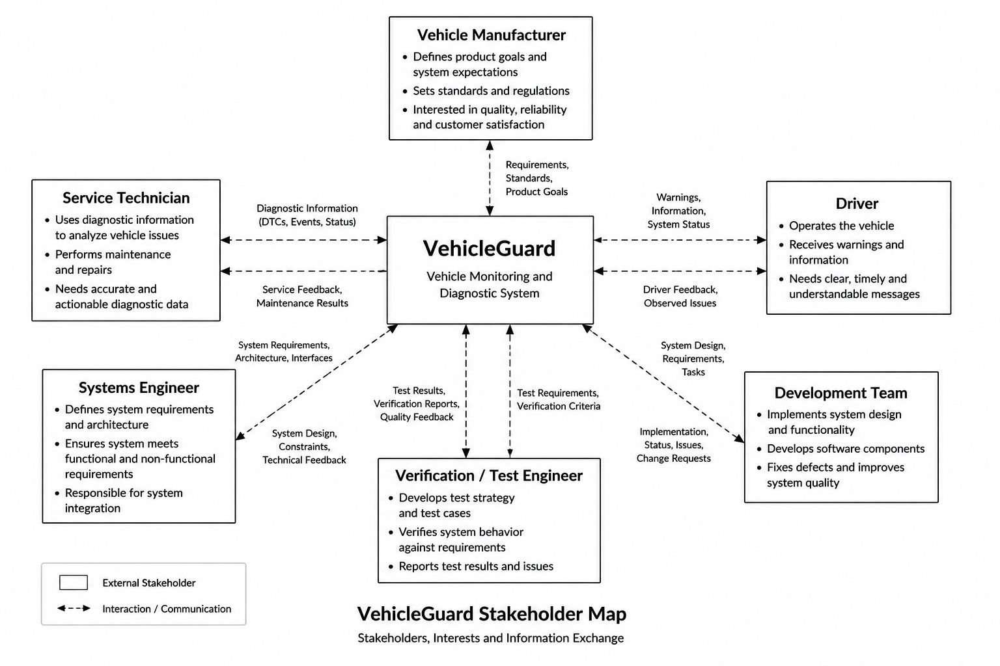

# VehicleGuard Stakeholder Analysis

## 1. Document Purpose

This document identifies the main stakeholders of VehicleGuard and describes their interests, responsibilities, and needs related to the system.

The stakeholder analysis provides the basis for defining stakeholder requirements and, later, detailed system requirements.

At this stage, the focus is on understanding what different stakeholders expect from VehicleGuard rather than defining how these expectations will be technically implemented.

Detailed system behaviour will be defined separately in `03-system-requirements.md`.

---

## 2. Stakeholder Identification

A stakeholder is a person, group, or organization that has an interest in the VehicleGuard system, influences its development, uses its outputs, or is affected by its behaviour.

For VehicleGuard V1, the following stakeholder groups are considered:

| ID    | Stakeholder                  | Main Interest                                                                      |
| ----- | ---------------------------- | ---------------------------------------------------------------------------------- |
| SH-01 | Driver                       | Clear and timely information about relevant vehicle conditions                     |
| SH-02 | Service Technician           | Useful diagnostic information for fault investigation and maintenance              |
| SH-03 | Vehicle Manufacturer         | Consistent system behaviour, reliability, maintainability, and product integration |
| SH-04 | Systems Engineer             | Clear requirements, architecture, interfaces, and traceability                     |
| SH-05 | Development Team             | Implementable and sufficiently defined system behaviour                            |
| SH-06 | Verification / Test Engineer | Verifiable requirements and observable system behaviour                            |

These stakeholders represent both users of VehicleGuard outputs and engineering roles involved in the development and verification of the system.

---

## 3. Stakeholder Map

The following diagram provides an overview of the main VehicleGuard stakeholders and the information exchanged between them and the system.



<p align="center">
  <em>Figure 1 - VehicleGuard stakeholder map</em>
</p>

The diagram is a project-level representation of stakeholder relationships.

It does not represent the internal VehicleGuard architecture or physical vehicle communication topology.

---

## 4. Driver

### Role

The driver is the primary recipient of vehicle condition information generated by VehicleGuard.

The driver operates the vehicle but is not expected to interpret raw sensor values, internal diagnostic logic, or technical fault data.

VehicleGuard should therefore transform relevant diagnostic results into information that can be understood without detailed technical knowledge.

### Main Interests

The driver is interested in:

* knowing whether the monitored vehicle condition is normal;
* being informed when a condition requires attention;
* understanding the seriousness of a detected condition;
* receiving information at the appropriate time;
* avoiding unnecessary or misleading warnings.

### Stakeholder Needs

**SN-DRV-001**

The driver needs to be informed when VehicleGuard detects a condition that requires driver attention.

**SN-DRV-002**

The driver needs to understand the severity of a detected condition without interpreting raw diagnostic data.

**SN-DRV-003**

The driver needs warnings to be based on sufficiently validated vehicle information.

**SN-DRV-004**

The driver needs normal vehicle operation to remain distinguishable from warning and critical conditions.

---

## 5. Service Technician

### Role

The service technician uses diagnostic information to support vehicle fault investigation and maintenance activities.

Unlike the driver, the service technician may require more detailed technical information about a detected event.

VehicleGuard V1 does not implement a real service center infrastructure. The service technician is included as a stakeholder because the diagnostic information produced by VehicleGuard should be structured so that it could support later technical analysis.

### Main Interests

The service technician is interested in:

* identifying which monitored parameter caused a diagnostic event;
* knowing the value associated with the event;
* understanding the detected condition;
* knowing the assigned severity;
* distinguishing vehicle condition faults from invalid input data;
* having consistent diagnostic event information.

### Stakeholder Needs

**SN-SRV-001**

The service technician needs sufficient information to identify the source of a detected diagnostic event.

**SN-SRV-002**

The service technician needs diagnostic events to contain relevant information about the detected condition.

**SN-SRV-003**

The service technician needs to distinguish between abnormal vehicle conditions and problems with the input data itself.

**SN-SRV-004**

The service technician needs diagnostic information to use consistent identifiers and classifications.

---

## 6. Vehicle Manufacturer

### Role

The vehicle manufacturer represents the product-level perspective.

In a real automotive development environment, the manufacturer would define product expectations, integration constraints, quality targets, and system-level requirements.

VehicleGuard is an independent portfolio project and is not developed for a real manufacturer. This stakeholder therefore represents a conceptual OEM perspective.

### Main Interests

The vehicle manufacturer is interested in:

* predictable system behaviour;
* clearly defined system boundaries;
* consistent diagnostic behaviour;
* controlled system changes;
* maintainable requirements and documentation;
* traceability between system needs, requirements, implementation, and verification;
* avoiding functionality outside the agreed project scope.

### Stakeholder Needs

**SN-OEM-001**

The vehicle manufacturer needs VehicleGuard behaviour to be defined through documented and traceable requirements.

**SN-OEM-002**

The vehicle manufacturer needs the system scope and responsibilities to be clearly defined.

**SN-OEM-003**

The vehicle manufacturer needs significant system changes to be evaluated before implementation.

**SN-OEM-004**

The vehicle manufacturer needs evidence that the defined system behaviour has been verified.

---

## 7. Systems Engineer

### Role

The systems engineer translates stakeholder needs into a structured technical system definition.

Within VehicleGuard, this includes requirements definition, system boundaries, functional decomposition, architecture, interfaces, traceability, and coordination between system behaviour and verification.

### Main Interests

The systems engineer is interested in:

* clear stakeholder needs;
* unambiguous system requirements;
* defined system boundaries;
* consistent system architecture;
* defined interfaces;
* traceability;
* controlled changes;
* verifiable system behaviour.

### Stakeholder Needs

**SN-SYS-001**

The systems engineer needs stakeholder expectations to be documented clearly enough to derive system requirements.

**SN-SYS-002**

The systems engineer needs each important system function to have a defined purpose within the project scope.

**SN-SYS-003**

The systems engineer needs relationships between stakeholder needs, system requirements, architecture elements, and verification activities to remain traceable.

**SN-SYS-004**

The systems engineer needs changes affecting system behaviour to be documented and reviewed.

---

## 8. Development Team

### Role

The development team implements the behaviour defined by the system requirements and architecture.

For VehicleGuard V1, this primarily refers to implementation of the software-based vehicle simulator and diagnostic prototype.

The development team should not be responsible for deciding undefined system behaviour during implementation.

When requirements are incomplete or ambiguous, the issue should be returned for clarification rather than silently resolved through implementation assumptions.

### Main Interests

The development team is interested in:

* clear and implementable requirements;
* defined input and output behaviour;
* stable interfaces;
* documented configuration parameters;
* clear fault handling behaviour;
* controlled requirement changes.

### Stakeholder Needs

**SN-DEV-001**

The development team needs system requirements that provide sufficient information to implement the expected behaviour.

**SN-DEV-002**

The development team needs VehicleGuard inputs and outputs to be clearly defined.

**SN-DEV-003**

The development team needs configurable values and implementation assumptions to be documented.

**SN-DEV-004**

The development team needs requirement changes to be communicated and traceable.

---

## 9. Verification / Test Engineer

### Role

The verification and test engineer evaluates whether VehicleGuard behaves according to the defined system requirements.

This includes testing normal operation, abnormal conditions, boundary values, invalid inputs, and selected fault scenarios.

Verification activities should be based on requirements rather than on the behaviour that happens to exist in the prototype.

### Main Interests

The verification and test engineer is interested in:

* testable requirements;
* measurable expected results;
* defined operating conditions;
* defined boundary behaviour;
* reproducible test inputs;
* traceability between requirements and test cases;
* documented test results.

### Stakeholder Needs

**SN-TST-001**

The verification engineer needs system requirements that can be objectively verified.

**SN-TST-002**

The verification engineer needs expected system behaviour to be defined for relevant normal and abnormal conditions.

**SN-TST-003**

The verification engineer needs test cases to be traceable to the requirements they verify.

**SN-TST-004**

The verification engineer needs test results to record whether the observed behaviour matches the expected behaviour.

---

## 10. Stakeholder Need Identification

Stakeholder needs use identifiers based on the stakeholder group.

| Prefix   | Stakeholder                  |
| -------- | ---------------------------- |
| `SN-DRV` | Driver                       |
| `SN-SRV` | Service Technician           |
| `SN-OEM` | Vehicle Manufacturer         |
| `SN-SYS` | Systems Engineer             |
| `SN-DEV` | Development Team             |
| `SN-TST` | Verification / Test Engineer |

For example:

```text
SN-DRV-001
```

identifies the first documented Driver need.

Stakeholder need identifiers remain stable once they are used for traceability.

If a need is later removed or replaced, its identifier should not be reused for an unrelated need.

---

## 11. From Stakeholder Needs to System Requirements

Stakeholder needs describe what stakeholders expect from VehicleGuard.

They do not yet define the complete technical behaviour required to satisfy those expectations.

The next step is to derive system requirements.

For example:

```text
Driver Need

SN-DRV-001
The driver needs to be informed when VehicleGuard detects
a condition that requires driver attention.

                    |
                    v

System Requirements

SYS-MON-...
Monitoring behaviour

SYS-DIAG-...
Fault detection behaviour

SYS-SEV-...
Severity classification

SYS-WRN-...
Driver warning behaviour
```

One stakeholder need may result in several system requirements.

A single system requirement may also support more than one stakeholder need.

These relationships will be documented through requirements traceability.

---

## 12. Stakeholder Priorities

Not all stakeholder needs have the same importance.

For VehicleGuard V1, the following priority model will be used when requirements are derived:

| Priority | Meaning                                                                              |
| -------- | ------------------------------------------------------------------------------------ |
| High     | Necessary for the core VehicleGuard V1 behaviour or for reliable verification        |
| Medium   | Important for system usability, diagnostics, maintainability, or engineering quality |
| Low      | Useful but not necessary for completion of the initial V1 scope                      |

Priority does not replace engineering analysis.

A lower-priority need may still become important if later architecture or risk analysis shows that it affects another critical part of the system.

Detailed priorities will be assigned during requirements development rather than assumed during initial stakeholder identification.

---

## 13. Stakeholder Conflicts

Stakeholder expectations may conflict with each other.

For example, a driver may prefer to receive fewer warnings, while a diagnostic perspective may favor reporting more abnormal conditions.

Similarly, the development team may prefer simple implementation logic, while verification and systems engineering may require additional behaviour to handle invalid or uncertain input data correctly.

Potential conflicts should not be resolved through undocumented implementation decisions.

When a conflict affects VehicleGuard behaviour, it should be addressed through requirements analysis and documented engineering decisions.

---

## 14. Current Limitations

The stakeholder analysis represents the current VehicleGuard V1 concept.

The following limitations apply:

* no real vehicle manufacturer is involved in the project;
* no real service organization is integrated;
* stakeholder expectations are derived from the conceptual VehicleGuard use case;
* the project does not represent the complete stakeholder structure of a production automotive development program;
* regulatory authorities and suppliers are not included as direct V1 stakeholders;
* additional stakeholders may be introduced if later system development provides a clear engineering reason.

The stakeholder model should remain limited to roles that have a meaningful relationship with the defined VehicleGuard scope.

---

## 15. Next Step

The next project activity is the derivation of VehicleGuard system requirements.

The stakeholder needs defined in this document will be reviewed and translated into technical requirements describing system behaviour.

The resulting requirements will be maintained in:

`docs/03-system-requirements.md`

and later connected to architecture elements and verification activities through requirements traceability.
