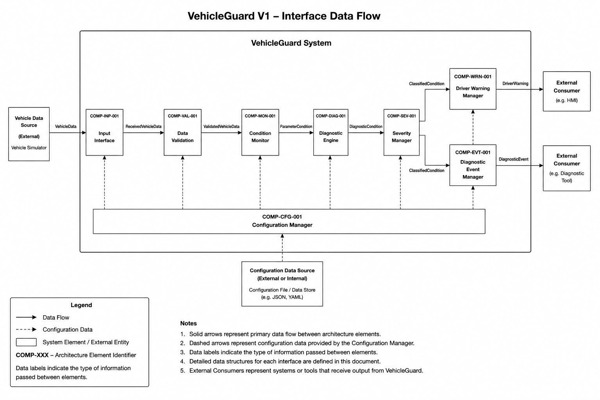

# VehicleGuard Interface Specification

## 1. Purpose

This document defines the logical interfaces and data exchanged between the VehicleGuard V1 architecture elements.

The interface specification provides a common definition of the information entering, moving through, and leaving the VehicleGuard system.

The purpose of this document is to define:

- external vehicle data inputs;
- internal data exchanged between architecture elements;
- data types and engineering units;
- supported input ranges;
- configuration data interfaces;
- driver warning outputs;
- diagnostic event outputs;
- interface behaviour for invalid data.

The interfaces defined here provide the basis for prototype implementation and interface-level verification.

---

## 2. Interface Scope

VehicleGuard V1 uses logical interfaces between the architecture elements defined in `04-system-architecture.md`.

The interface specification covers:

```text
Vehicle Data Source
        |
        v
COMP-INP-001
        |
        v
COMP-VAL-001
        |
        v
COMP-MON-001
        |
        v
COMP-DIAG-001
        |
        v
COMP-SEV-001
       / \
      /   \
     v     v
COMP-WRN-001    COMP-EVT-001
```

`COMP-CFG-001` provides configuration information to architecture elements that require configurable system behaviour.

This document defines logical information exchange.

It does not define:

- physical CAN frames;
- CAN identifiers;
- AUTOSAR interfaces;
- ECU memory layouts;
- communication bus timing;
- network protocols;
- production diagnostic protocols;
- production HMI communication.

These topics are outside the VehicleGuard V1 scope.

---

## 3. Interface Principles

### 3.1 Explicit Data Contracts

Information exchanged between architecture elements should use defined data structures with known fields, types, and meanings.

### 3.2 Engineering Units

Numeric vehicle parameters use explicitly defined engineering units.

A value must not require the receiving element to guess its unit.

### 3.3 Validation Before Interpretation

Raw received values are not treated as valid vehicle operating information until the required validation has been completed.

### 3.4 Invalid Data Separation

Invalid input data must remain distinguishable from a valid value representing an abnormal vehicle condition.

### 3.5 Configuration Separation

Supported ranges, monitoring thresholds, and severity criteria are provided as configuration information rather than being permanently embedded in the interface definition.

### 3.6 Interface Traceability

Interface definitions must remain consistent with the system requirements and architecture responsibilities defined elsewhere in the project.

---

## 4. Interface Overview

The VehicleGuard V1 interface data flow is shown below.



<p align="center">
  <em>Figure 1 - VehicleGuard V1 Interface Data Flow</em>
</p>

The primary data interfaces are:

| Interface ID | Source | Destination | Data |
|---|---|---|---|
| `IF-EXT-001` | Vehicle Data Source | `COMP-INP-001` | `VehicleData` |
| `IF-INT-001` | `COMP-INP-001` | `COMP-VAL-001` | `ReceivedVehicleData` |
| `IF-INT-002` | `COMP-VAL-001` | `COMP-MON-001` | `ValidatedVehicleData` |
| `IF-INT-003` | `COMP-MON-001` | `COMP-DIAG-001` | `ParameterCondition` |
| `IF-INT-004` | `COMP-DIAG-001` | `COMP-SEV-001` | `DiagnosticCondition` |
| `IF-INT-005` | `COMP-SEV-001` | `COMP-WRN-001` | `ClassifiedCondition` |
| `IF-INT-006` | `COMP-SEV-001` | `COMP-EVT-001` | `ClassifiedCondition` |
| `IF-CFG-001` | `COMP-CFG-001` | Processing Elements | Configuration Data |
| `IF-OUT-001` | `COMP-WRN-001` | External Consumer | `DriverWarning` |
| `IF-OUT-002` | `COMP-EVT-001` | External Consumer | `DiagnosticEvent` |

Interface identifiers are used to reference logical information exchanges throughout the project.

---

## 5. Vehicle Data Input Interface

### 5.1 Interface Definition

`IF-EXT-001` provides vehicle operating data to VehicleGuard.

For the V1 prototype, the external vehicle data source is represented by `vehicle_simulator.py`.

The simulator represents the external source only. It does not perform VehicleGuard diagnostic classification.

The input structure is identified as:

`VehicleData`

---

### 5.2 VehicleData Structure

The initial VehicleGuard V1 input structure contains:

| Field | Type | Unit | Required | Description |
|---|---|---|---|---|
| `timestamp` | float | s | Yes | Time associated with the vehicle data sample |
| `coolant_temperature` | float | °C | Yes | Engine coolant temperature |
| `battery_voltage` | float | V | Yes | Vehicle electrical system voltage |
| `oil_pressure` | float | kPa | Yes | Engine oil pressure |
| `engine_rpm` | integer | rpm | Yes | Engine rotational speed |
| `brake_pad_remaining` | float | % | Yes | Estimated remaining brake pad material |

Example logical representation:

```text
VehicleData
|
+-- timestamp
+-- coolant_temperature
+-- battery_voltage
+-- oil_pressure
+-- engine_rpm
+-- brake_pad_remaining
```

The exact software representation may use a dictionary, data class, object, or another appropriate structure.

The logical interface definition remains independent of that implementation choice.

---

## 6. Vehicle Parameter Definitions

### 6.1 Timestamp

**Field**

`timestamp`

**Type**

`float`

**Unit**

seconds (`s`)

**Description**

Represents the time associated with the current vehicle data sample.

The timestamp supports temporal identification of diagnostic events and verification results.

The V1 interface does not require synchronization with a production vehicle time source.

---

### 6.2 Coolant Temperature

**Field**

`coolant_temperature`

**Type**

`float`

**Unit**

degrees Celsius (`°C`)

**Description**

Represents engine coolant temperature used by VehicleGuard for monitoring and diagnostic evaluation.

---

### 6.3 Battery Voltage

**Field**

`battery_voltage`

**Type**

`float`

**Unit**

volts (`V`)

**Description**

Represents the vehicle electrical system voltage used for monitoring and diagnostic evaluation.

---

### 6.4 Oil Pressure

**Field**

`oil_pressure`

**Type**

`float`

**Unit**

kilopascals (`kPa`)

**Description**

Represents engine oil pressure used for monitoring and diagnostic evaluation.

---

### 6.5 Engine RPM

**Field**

`engine_rpm`

**Type**

`integer`

**Unit**

revolutions per minute (`rpm`)

**Description**

Represents engine rotational speed.

Engine RPM may also provide operating context for other diagnostic evaluations.

---

### 6.6 Brake Pad Remaining

**Field**

`brake_pad_remaining`

**Type**

`float`

**Unit**

percent (`%`)

**Description**

Represents an estimated percentage of remaining brake pad material.

A larger value represents more remaining brake material.

The input source provides the measured or simulated value only.

It does not provide a preclassified state such as `NORMAL`, `WARNING`, or `CRITICAL`.

Condition and severity classification remain VehicleGuard responsibilities.

---

## 7. Supported Input Ranges

Supported input ranges define the values VehicleGuard accepts as processable input data.

They are used for data validation.

They must not be confused with diagnostic thresholds.

The initial V1 demonstration ranges are:

| Parameter | Minimum | Maximum | Unit |
|---|---:|---:|---|
| `timestamp` | 0 | No fixed V1 maximum | s |
| `coolant_temperature` | -40 | 150 | °C |
| `battery_voltage` | 0 | 20 | V |
| `oil_pressure` | 0 | 1000 | kPa |
| `engine_rpm` | 0 | 10000 | rpm |
| `brake_pad_remaining` | 0 | 100 | % |

These ranges are project-level demonstration assumptions.

They are not presented as universal production vehicle specifications.

For configurable numeric parameters:

```text
supported_min <= value <= supported_max
```

indicates that the value is eligible for diagnostic processing.

A value outside the supported range is treated as an invalid input condition rather than automatically being classified as an abnormal vehicle operating condition.

---

## 8. Supported Range vs Diagnostic Threshold

The distinction between input validation and diagnostic evaluation is fundamental to the VehicleGuard architecture.

For example:

```text
Supported Input Range
        |
        v
Is this value valid input data?
```

is different from:

```text
Diagnostic Threshold
        |
        v
Does this valid value indicate an abnormal condition?
```

Therefore:

```text
Input Range
    |
    +-> COMP-VAL-001

Monitoring Threshold
    |
    +-> COMP-MON-001 / COMP-DIAG-001

Severity Criteria
    |
    +-> COMP-SEV-001
```

A value may be:

- valid and normal;
- valid and abnormal;
- invalid and therefore not suitable for normal diagnostic evaluation.

This distinction prevents corrupted or unsupported data from being interpreted as a genuine vehicle fault.

---

## 9. Internal Interfaces

### 9.1 IF-INT-001 - Received Vehicle Data

**Source**

`COMP-INP-001`

**Destination**

`COMP-VAL-001`

**Data**

`ReceivedVehicleData`

The structure contains the vehicle data received through the external input interface together with the associated timestamp.

At this stage, the information has been received but has not yet been confirmed as valid for diagnostic evaluation.

Conceptually:

```text
ReceivedVehicleData
|
+-- timestamp
+-- received parameter values
```

---

### 9.2 IF-INT-002 - Validated Vehicle Data

**Source**

`COMP-VAL-001`

**Destination**

`COMP-MON-001`

**Data**

`ValidatedVehicleData`

This interface contains vehicle data that has passed the required validation checks.

Conceptually:

```text
ValidatedVehicleData
|
+-- timestamp
+-- parameter
+-- value
+-- unit
+-- validation_status
```

For normal diagnostic processing:

```text
validation_status = VALID
```

Invalid information is handled separately and must not be presented to the monitoring function as valid vehicle data.

---

### 9.3 IF-INT-003 - Parameter Condition

**Source**

`COMP-MON-001`

**Destination**

`COMP-DIAG-001`

**Data**

`ParameterCondition`

The interface describes the result of monitoring a validated vehicle parameter.

Conceptually:

```text
ParameterCondition
|
+-- timestamp
+-- parameter
+-- observed_value
+-- condition_status
```

The information allows the Diagnostic Engine to determine whether a configured abnormal condition is present.

---

### 9.4 IF-INT-004 - Diagnostic Condition

**Source**

`COMP-DIAG-001`

**Destination**

`COMP-SEV-001`

**Data**

`DiagnosticCondition`

The interface represents a condition identified by the Diagnostic Engine.

Conceptually:

```text
DiagnosticCondition
|
+-- timestamp
+-- condition_id
+-- parameter
+-- observed_value
+-- condition_type
```

`condition_id` provides a stable identifier for the detected diagnostic condition.

The severity level is not assigned by the Diagnostic Engine.

That responsibility belongs to `COMP-SEV-001`.

---

### 9.5 IF-INT-005 - Classified Condition for Driver Warning

**Source**

`COMP-SEV-001`

**Destination**

`COMP-WRN-001`

**Data**

`ClassifiedCondition`

Conceptually:

```text
ClassifiedCondition
|
+-- timestamp
+-- condition_id
+-- parameter
+-- observed_value
+-- severity
```

The supported severity values are:

```text
NORMAL
INFO
WARNING
CRITICAL
```

The Driver Warning Manager determines whether driver warning information is required based on the classified condition.

---

### 9.6 IF-INT-006 - Classified Condition for Diagnostic Event

**Source**

`COMP-SEV-001`

**Destination**

`COMP-EVT-001`

**Data**

`ClassifiedCondition`

The same logical classified condition information may be used for diagnostic event generation.

The Driver Warning Manager and Diagnostic Event Manager remain separate because their outputs serve different purposes and consumers.

---

## 10. Configuration Interface

### 10.1 Purpose

`COMP-CFG-001` provides configuration data required by VehicleGuard processing elements.

The configuration interface is identified as:

`IF-CFG-001`

Configuration information may include:

- supported input ranges;
- monitoring thresholds;
- abnormal condition criteria;
- severity criteria;
- parameter-specific settings;
- output-related configuration where required.

---

### 10.2 Parameter Configuration

A logical parameter configuration may contain:

```text
ParameterConfiguration
|
+-- parameter_id
+-- unit
+-- supported_min
+-- supported_max
+-- monitoring_criteria
+-- severity_criteria
```

Not every field must be applicable to every parameter.

The configuration representation used by the prototype may be implemented using a structured file such as JSON or another suitable format.

The file format itself is an implementation decision.

---

### 10.3 Configuration Consistency

A single active configuration set should be used consistently during processing of a vehicle data sample.

Configuration changes must not result in different processing elements evaluating the same sample using contradictory criteria.

Dynamic runtime configuration updates are not required for VehicleGuard V1.

---

## 11. Driver Warning Output Interface

### 11.1 Interface Definition

The Driver Warning Manager provides driver-oriented warning information through:

`IF-OUT-001`

The logical output structure is:

`DriverWarning`

---

### 11.2 DriverWarning Structure

Conceptually:

```text
DriverWarning
|
+-- timestamp
+-- condition_id
+-- parameter
+-- severity
+-- message
```

| Field | Description |
|---|---|
| `timestamp` | Time associated with the detected condition |
| `condition_id` | Identifier of the condition that caused the warning |
| `parameter` | Vehicle parameter associated with the condition |
| `severity` | Assigned severity level |
| `message` | Driver-oriented description |

Driver warning output is generated for conditions requiring driver attention according to the system requirements.

VehicleGuard V1 does not define the graphical presentation of this information on a production instrument cluster.

---

## 12. Diagnostic Event Output Interface

### 12.1 Interface Definition

The Diagnostic Event Manager provides structured technical diagnostic information through:

`IF-OUT-002`

The logical output structure is:

`DiagnosticEvent`

---

### 12.2 DiagnosticEvent Structure

Conceptually:

```text
DiagnosticEvent
|
+-- timestamp
+-- condition_id
+-- parameter
+-- observed_value
+-- severity
+-- event_type
```

| Field | Description |
|---|---|
| `timestamp` | Time associated with the diagnostic event |
| `condition_id` | Defined condition or fault identifier |
| `parameter` | Affected vehicle parameter |
| `observed_value` | Value associated with the detected condition, where available |
| `severity` | Assigned severity level |
| `event_type` | Type of diagnostic event |

The output is intended for technical diagnostic analysis, prototype observation, and verification.

It does not represent a production diagnostic protocol such as UDS.

---

## 13. Invalid Data Handling

Invalid data must be handled separately from abnormal vehicle operating conditions.

Examples of invalid input include:

- required parameter missing;
- unsupported data type;
- numeric value outside the configured supported input range;
- malformed input structure.

Conceptually:

```text
VehicleData
     |
     v
Validation
     |
     +---- VALID ----> Diagnostic Processing
     |
     +---- INVALID --> Invalid Input Handling
```

An invalid input must not automatically produce a vehicle fault classification based on the invalid numeric value.

For example, a coolant temperature outside the supported interface range represents an invalid input condition at the validation level.

It does not automatically mean that VehicleGuard has detected a genuine engine overheating condition.

Diagnostic information may still be generated to indicate that the input itself was invalid.

---

## 14. Multiple Parameter Processing

A `VehicleData` sample may contain multiple monitored vehicle parameters.

VehicleGuard evaluates the parameters independently according to their applicable validation and diagnostic criteria.

Therefore, one input sample may result in:

```text
0 abnormal conditions
1 abnormal condition
or
multiple abnormal conditions
```

Each detected condition may receive its own:

- condition identifier;
- observed value;
- severity classification;
- diagnostic event;
- driver warning where applicable.

This supports the requirement that multiple abnormal conditions can be detected within the same vehicle data sample.

---

## 15. Interface Identification

VehicleGuard uses the following interface identifier convention:

```text
IF-EXT-XXX
```

for external input interfaces,

```text
IF-INT-XXX
```

for internal interfaces,

```text
IF-CFG-XXX
```

for configuration interfaces,

and:

```text
IF-OUT-XXX
```

for system output interfaces.

Existing identifiers should not be reused for unrelated interfaces.

If an interface is removed, its identifier should remain identifiable in project history.

---

## 16. Interface Traceability

The interface specification connects the system architecture to implementation and verification.

The relationship is:

```text
System Requirement
        |
        v
Architecture Element
        |
        v
Interface
        |
        v
Implementation
        |
        v
Verification
```

Examples include:

| Requirement | Architecture Element | Interface |
|---|---|---|
| `SYS-INP-001` | `COMP-INP-001` | `IF-EXT-001` |
| `SYS-INP-007` | `COMP-INP-001` | `IF-EXT-001` |
| `SYS-VAL-001` | `COMP-VAL-001` | `IF-INT-001`, `IF-INT-002` |
| `SYS-MON-001` | `COMP-MON-001` | `IF-INT-002`, `IF-INT-003` |
| `SYS-DIAG-001` | `COMP-DIAG-001` | `IF-INT-003`, `IF-INT-004` |
| `SYS-SEV-001` | `COMP-SEV-001` | `IF-INT-004`, `IF-INT-005`, `IF-INT-006` |
| `SYS-WRN-001` | `COMP-WRN-001` | `IF-INT-005`, `IF-OUT-001` |
| `SYS-EVT-001` | `COMP-EVT-001` | `IF-INT-006`, `IF-OUT-002` |
| `SYS-CFG-001` | `COMP-CFG-001` | `IF-CFG-001` |

Detailed requirement relationships are maintained in the requirements register.

---

## 17. Interface Constraints

The VehicleGuard V1 interfaces are subject to the following constraints.

### 17.1 Logical Interface Definition

Interfaces in this document represent logical data exchange and do not claim a production vehicle communication implementation.

### 17.2 Defined Units

Numeric monitored parameters must use the engineering units defined in this document unless a controlled interface change is introduced.

### 17.3 No Implicit Severity Input

External vehicle data must not provide preclassified VehicleGuard severity values for monitored physical parameters.

Severity classification is an internal VehicleGuard responsibility.

### 17.4 Invalid Data Protection

Invalid data must not bypass validation and enter normal diagnostic processing as valid vehicle information.

### 17.5 Configuration Separation

Diagnostic thresholds and severity criteria must remain distinguishable from supported input ranges.

### 17.6 Interface Compatibility

Changes to interface field names, data types, units, or semantics must be reviewed for impact on:

- system requirements;
- architecture;
- prototype implementation;
- configuration;
- test cases;
- traceability.

---

## 18. Prototype Mapping

The prototype will implement the logical interfaces defined in this document.

The initial mapping is expected to include:

```text
prototype/
|
+-- vehicle_simulator.py
|
+-- diagnostics.py
|
+-- config/
```

`vehicle_simulator.py` represents the external vehicle data source.

`diagnostics.py` implements the VehicleGuard diagnostic processing responsibilities.

The `config/` directory contains configuration information required for demonstration and verification.

This file organization does not redefine the system architecture.

Multiple architecture elements may be implemented within the same prototype module as long as their logical responsibilities remain identifiable.

---

## 19. Interface Baseline Status

The interfaces defined in this document represent the initial VehicleGuard V1 interface specification.

The current interface status is:

`Draft - Under Engineering Review`

The interface definitions will be reviewed during prototype implementation and verification planning.

Before the initial interface baseline is established, the following should be checked:

- all required system inputs are represented;
- data types are defined;
- engineering units are defined;
- supported input ranges are defined;
- internal data exchanges are consistent with the architecture;
- outputs contain the information required by system requirements;
- invalid input behaviour is defined;
- configuration responsibilities are consistent with the architecture;
- interfaces remain traceable to system requirements.

Significant interface changes after baseline establishment should be handled through the project change management process.
