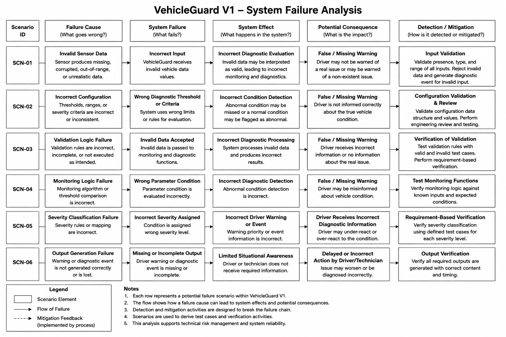

# VehicleGuard System Risk Analysis

## 1. Purpose

This document identifies and evaluates technical failure scenarios that may affect the behaviour of VehicleGuard V1.

The purpose of the analysis is to understand how failures in input data, configuration, diagnostic processing, severity classification, or output generation could influence the information produced by the system.

The analysis is used to:

- identify relevant technical failure scenarios;
- understand possible system effects and consequences;
- define detection and mitigation measures;
- support verification planning;
- identify areas requiring additional engineering attention;
- maintain traceability between system risks, requirements, architecture, and tests.

This document focuses on failures of the VehicleGuard system concept.

Project management risks such as schedule, scope growth, documentation quality, or uncontrolled project changes are maintained separately in:

`project-management/risk-register.md`

---

## 2. Scope

The analysis covers the VehicleGuard V1 diagnostic processing chain:

```text
Vehicle Data
     |
     v
Input Reception
     |
     v
Data Validation
     |
     v
Condition Monitoring
     |
     v
Diagnostic Detection
     |
     v
Severity Classification
     |
     +----------------+
     |                |
     v                v
Driver Warning   Diagnostic Event
```

Configuration data used by the processing functions is also included in the analysis.

The following areas are outside the current analysis scope:

- physical sensor failure mechanisms;
- production vehicle ECU hardware;
- CAN bus electrical failures;
- AUTOSAR communication failures;
- production HMI hardware;
- vehicle actuator failures;
- cybersecurity threats;
- cloud infrastructure;
- production diagnostic infrastructure;
- detailed functional safety classification.

VehicleGuard V1 is a conceptual engineering prototype and is not a production safety system.

---

## 3. Analysis Approach

The analysis follows a simplified system failure chain:

```text
Failure Cause
      |
      v
System Failure
      |
      v
System Effect
      |
      v
Potential Consequence
      |
      v
Detection / Mitigation
```

The objective is not only to identify what may fail, but also to understand how that failure propagates through VehicleGuard.

For each scenario, the analysis considers:

- the initiating failure or incorrect condition;
- the resulting system failure;
- the effect on VehicleGuard processing;
- the potential consequence;
- available detection or mitigation measures;
- affected architecture elements;
- related system requirements;
- verification activities that may detect the failure.

The analysis is qualitative.

Numerical failure rates, ASIL classifications, hardware reliability calculations, and production safety targets are not assigned.

---

## 4. System Failure Analysis

The main VehicleGuard V1 failure scenarios are summarized below.



<p align="center">
  <em>Figure 1 - VehicleGuard V1 System Failure Analysis</em>
</p>

The diagram shows how an initiating failure can propagate through the system and eventually influence the information provided to the driver or diagnostic consumer.

Detection and mitigation activities are intended to interrupt this failure chain before an incorrect system output is produced.

---

## 5. Failure Scenario Identification

VehicleGuard failure scenarios use the following identifier format:

```text
SCN-XX
```

where `XX` represents the scenario number.

The initial V1 analysis contains six primary scenarios:

| ID | Failure Scenario | Primary Area |
|---|---|---|
| `SCN-01` | Invalid Sensor Data | Input / Validation |
| `SCN-02` | Incorrect Configuration | Configuration |
| `SCN-03` | Validation Logic Failure | Validation |
| `SCN-04` | Monitoring Logic Failure | Monitoring / Diagnostics |
| `SCN-05` | Severity Classification Failure | Severity Classification |
| `SCN-06` | Output Generation Failure | Warning / Diagnostic Output |

Additional scenarios may be introduced if implementation, verification, or architecture review identifies new relevant failure mechanisms.

---

## 6. SCN-01 - Invalid Sensor Data

### 6.1 Failure Cause

The external vehicle data source provides missing, corrupted, unsupported, out-of-range, or otherwise invalid data.

Examples include:

- missing required parameter;
- incorrect data type;
- value outside the supported input range;
- malformed input structure.

### 6.2 System Failure

VehicleGuard receives vehicle data that cannot safely be interpreted as a valid operating value.

### 6.3 System Effect

If the invalid value is not detected, it may enter monitoring and diagnostic processing as if it represented a real vehicle condition.

This could result in incorrect diagnostic evaluation.

### 6.4 Potential Consequence

Possible consequences include:

- false warning;
- missing warning;
- incorrect diagnostic event;
- incorrect severity classification;
- misleading diagnostic information.

### 6.5 Detection and Mitigation

The primary mitigation is input validation performed by:

`COMP-VAL-001 - Data Validation`

The validation function checks:

- required parameter presence;
- supported data type;
- supported input range;
- input suitability for diagnostic processing.

Invalid input must remain distinguishable from an abnormal vehicle operating condition.

### 6.6 Related Requirements

Relevant requirements include:

- `SYS-VAL-001`
- `SYS-VAL-002`
- `SYS-VAL-003`
- `SYS-VAL-004`
- `SYS-VAL-005`
- `SYS-VAL-006`
- `SYS-EVT-007`

### 6.7 Verification Focus

Verification should include:

- missing parameter cases;
- incorrect data types;
- values below supported ranges;
- values above supported ranges;
- valid boundary values;
- confirmation that invalid data does not enter normal diagnostic evaluation.

---

## 7. SCN-02 - Incorrect Configuration

### 7.1 Failure Cause

VehicleGuard uses incorrect, inconsistent, incomplete, or unintended configuration data.

Examples include:

- incorrect monitoring threshold;
- incorrect supported input range;
- incorrect severity criteria;
- configuration value assigned to the wrong parameter;
- inconsistent configuration between processing functions.

### 7.2 System Failure

VehicleGuard evaluates valid vehicle data using incorrect diagnostic criteria.

### 7.3 System Effect

A real abnormal condition may not be detected, or a normal condition may incorrectly be identified as abnormal.

Severity may also be assigned incorrectly.

### 7.4 Potential Consequence

Possible consequences include:

- false warning;
- missing warning;
- incorrect severity;
- incorrect diagnostic event;
- inconsistent system behaviour.

### 7.5 Detection and Mitigation

Mitigation measures include:

- structured configuration data;
- defined parameter identifiers;
- configuration review;
- configuration validation;
- requirement-based testing;
- consistent use of one active configuration set.

Configuration responsibility is assigned to:

`COMP-CFG-001 - Configuration Manager`

### 7.6 Related Requirements

Relevant requirements include:

- `SYS-CFG-001`
- `SYS-CFG-002`
- `SYS-CFG-003`
- `SYS-CFG-004`
- `SYS-CFG-005`
- `SYS-SEV-004`

### 7.7 Verification Focus

Verification should include:

- known configuration values;
- boundary conditions;
- intentionally invalid configuration;
- parameter-specific threshold checks;
- severity criteria checks;
- confirmation that the same active configuration is used consistently.

---

## 8. SCN-03 - Validation Logic Failure

### 8.1 Failure Cause

The validation function contains incorrect or incomplete validation logic.

Examples include:

- missing range check;
- incorrect comparison operator;
- incorrect data type handling;
- missing required-field detection;
- boundary value handled incorrectly.

### 8.2 System Failure

Invalid input is incorrectly classified as valid.

Alternatively, valid input may incorrectly be rejected.

### 8.3 System Effect

Invalid data may enter monitoring and diagnostic processing, or valid vehicle data may be unavailable for diagnostic evaluation.

### 8.4 Potential Consequence

Possible consequences include:

- false warning;
- missing warning;
- incorrect diagnostic event;
- loss of useful diagnostic information.

### 8.5 Detection and Mitigation

Mitigation is primarily achieved through verification of the validation function.

Validation behaviour should be tested using:

- valid inputs;
- invalid inputs;
- minimum supported values;
- maximum supported values;
- values immediately outside supported ranges;
- missing parameters;
- incorrect data types.

### 8.6 Related Architecture

Primary architecture element:

`COMP-VAL-001 - Data Validation`

Supporting interfaces:

- `IF-INT-001`
- `IF-INT-002`

### 8.7 Related Requirements

Relevant requirements include:

- `SYS-VAL-001`
- `SYS-VAL-002`
- `SYS-VAL-003`
- `SYS-VAL-004`
- `SYS-VAL-005`
- `SYS-VAL-006`

---

## 9. SCN-04 - Monitoring Logic Failure

### 9.1 Failure Cause

The monitoring or diagnostic logic evaluates a valid vehicle parameter incorrectly.

Examples include:

- incorrect threshold comparison;
- wrong parameter selected for evaluation;
- incorrect boundary handling;
- incorrect condition mapping;
- expected abnormal condition not detected.

### 9.2 System Failure

VehicleGuard determines an incorrect parameter condition.

### 9.3 System Effect

The Diagnostic Engine receives incorrect condition information or produces an incorrect diagnostic result.

### 9.4 Potential Consequence

Possible consequences include:

- real abnormal condition not detected;
- normal condition identified as abnormal;
- false warning;
- missing warning;
- incorrect diagnostic event.

### 9.5 Detection and Mitigation

Mitigation is based on requirement-driven testing of monitoring and diagnostic behaviour.

Tests should use controlled input values with known expected results.

Particular attention should be given to:

- threshold boundaries;
- values immediately below thresholds;
- values exactly at thresholds;
- values immediately above thresholds;
- recovery from abnormal to normal conditions;
- multiple simultaneous abnormal conditions.

### 9.6 Related Architecture

Primary architecture elements:

- `COMP-MON-001 - Condition Monitor`
- `COMP-DIAG-001 - Diagnostic Engine`

### 9.7 Related Requirements

Relevant requirements include:

- `SYS-MON-001` through `SYS-MON-006`
- `SYS-DIAG-001`
- `SYS-DIAG-002`
- `SYS-DIAG-003`
- `SYS-DIAG-004`
- `SYS-DIAG-005`

---

## 10. SCN-05 - Severity Classification Failure

### 10.1 Failure Cause

Severity classification rules, configuration, or mapping are incorrect.

### 10.2 System Failure

A detected condition receives the wrong severity level.

For example, a condition intended to be classified as `CRITICAL` could incorrectly be classified as `WARNING`.

### 10.3 System Effect

Downstream outputs receive incorrect severity information.

This may affect:

- driver warning priority;
- warning content;
- diagnostic event information.

### 10.4 Potential Consequence

The driver or technical consumer may receive information that does not correctly represent the significance of the detected condition.

Possible outcomes include under-reaction or unnecessary reaction to the reported condition.

### 10.5 Detection and Mitigation

Mitigation includes:

- defined severity levels;
- configurable severity criteria;
- independent severity test cases;
- boundary testing;
- requirement-based verification.

Severity classification responsibility belongs to:

`COMP-SEV-001 - Severity Manager`

### 10.6 Related Requirements

Relevant requirements include:

- `SYS-SEV-001`
- `SYS-SEV-002`
- `SYS-SEV-003`
- `SYS-SEV-004`
- `SYS-SEV-005`
- `SYS-WRN-002`
- `SYS-EVT-005`

### 10.7 Verification Focus

Each supported severity level should have defined test coverage:

```text
NORMAL
INFO
WARNING
CRITICAL
```

Tests should confirm both correct classification and correct behaviour at severity boundaries.

---

## 11. SCN-06 - Output Generation Failure

### 11.1 Failure Cause

A correctly detected and classified condition is not converted into the required output information.

Possible causes include:

- warning generation failure;
- diagnostic event generation failure;
- missing output field;
- incorrect condition identifier;
- incorrect parameter information;
- missing timestamp;
- incorrect message generation.

### 11.2 System Failure

Required driver warning or diagnostic event information is missing, incomplete, or incorrect.

### 11.3 System Effect

The system internally detects the condition but does not correctly communicate the result to the intended consumer.

### 11.4 Potential Consequence

The driver or technical consumer may have limited or incorrect information about the detected condition.

This may result in delayed or inappropriate response.

### 11.5 Detection and Mitigation

Mitigation is achieved through output verification.

Tests should confirm that required outputs contain the correct:

- timestamp;
- condition identifier;
- affected parameter;
- observed value where applicable;
- severity;
- warning message or event type.

### 11.6 Related Architecture

Primary architecture elements:

- `COMP-WRN-001 - Driver Warning Manager`
- `COMP-EVT-001 - Diagnostic Event Manager`

### 11.7 Related Requirements

Relevant requirements include:

- `SYS-WRN-001` through `SYS-WRN-005`
- `SYS-EVT-001` through `SYS-EVT-007`

---

## 12. Failure Scenario Summary

The initial failure analysis can be summarized as follows:

| ID | Failure Cause | Main Effect | Primary Mitigation |
|---|---|---|---|
| `SCN-01` | Invalid Sensor Data | Incorrect input enters the system | Input validation |
| `SCN-02` | Incorrect Configuration | Incorrect evaluation criteria | Configuration validation and review |
| `SCN-03` | Validation Logic Failure | Invalid data accepted or valid data rejected | Validation testing |
| `SCN-04` | Monitoring Logic Failure | Incorrect condition detection | Monitoring and diagnostic testing |
| `SCN-05` | Severity Classification Failure | Incorrect severity assigned | Severity verification |
| `SCN-06` | Output Generation Failure | Missing or incorrect output | Output verification |

The scenarios show that verification is an important mitigation mechanism throughout VehicleGuard V1.

---

## 13. Failure Propagation

VehicleGuard uses a sequential diagnostic processing architecture.

Because of this structure, a failure in an earlier processing stage may influence several later functions.

For example:

```text
Invalid Input
     |
     v
Validation Failure
     |
     v
Incorrect Monitoring
     |
     v
Incorrect Diagnostic Result
     |
     v
Incorrect Severity
     |
     v
Incorrect Output
```

This makes early detection particularly important.

Input validation and configuration consistency therefore provide protection against failure propagation into downstream processing.

Failures occurring later in the chain may have a more limited propagation path but can still directly affect externally visible system information.

---

## 14. Risk Reduction Strategy

VehicleGuard V1 uses several engineering measures to reduce the likelihood of incorrect diagnostic behaviour.

### 14.1 Input Validation

Input data is checked before diagnostic interpretation.

### 14.2 Defined Interfaces

Data structures, units, and meanings are documented in `05-interfaces.md`.

### 14.3 Configuration Separation

Diagnostic criteria are separated from the core processing logic.

### 14.4 Functional Separation

Validation, monitoring, diagnostics, severity classification, and output generation are represented as separate system responsibilities.

### 14.5 Requirement-Based Verification

System behaviour is verified against defined `SYS-xxx` requirements.

### 14.6 Boundary Testing

Threshold and supported-range boundaries are explicitly included in verification planning.

### 14.7 Traceability

Failures, requirements, architecture elements, and tests can be related through stable identifiers.

---

## 15. Risk Analysis and Verification

The failure scenarios defined in this document provide direct input to verification planning.

For example:

```text
SCN-01
Invalid Sensor Data
        |
        v
SYS-VAL-xxx
        |
        v
COMP-VAL-001
        |
        v
TC-xxx
Invalid Input Test
```

Similarly:

```text
SCN-05
Severity Classification Failure
        |
        v
SYS-SEV-xxx
        |
        v
COMP-SEV-001
        |
        v
TC-xxx
Severity Classification Test
```

The final test case identifiers will be assigned during development of the verification and validation documentation.

This allows the project to demonstrate that identified technical failure scenarios are considered during testing rather than remaining only as documentation.

---

## 16. Relationship to Project Risk Register

This system risk analysis and the project risk register serve different purposes.

| Document | Focus |
|---|---|
| `docs/06-risk-analysis.md` | Technical failures and incorrect VehicleGuard behaviour |
| `project-management/risk-register.md` | Risks affecting project execution and development quality |

For example:

```text
Incorrect VehicleGuard severity classification
```

belongs to the system risk analysis.

By contrast:

```text
Requirements are changed without updating tests
```

belongs to the project risk register.

Some relationships may exist between the two areas, but they should not be treated as the same type of risk.

---

## 17. Limitations of the Analysis

This document is a project-level engineering failure analysis.

It is not intended to represent a complete production automotive safety assessment.

The analysis does not currently include:

- ASIL classification;
- Automotive Safety Integrity Levels;
- formal Hazard Analysis and Risk Assessment;
- quantitative failure probability;
- hardware failure rates;
- diagnostic coverage calculations;
- fault tree analysis;
- dependent failure analysis;
- safety goals;
- functional safety requirements;
- technical safety requirements.

These activities would require additional system context, vehicle-level information, safety assumptions, and production engineering data that are outside the scope of VehicleGuard V1.

The current analysis should therefore not be presented as evidence of ISO 26262 compliance.

---

## 18. Risk Analysis Maintenance

The system risk analysis is a living engineering document.

It should be reviewed when:

- a new system requirement is introduced;
- an existing requirement changes significantly;
- the system architecture changes;
- an interface changes;
- a new monitored parameter is introduced;
- diagnostic logic changes;
- configuration behaviour changes;
- verification reveals an unexpected failure mode;
- a new system output is introduced.

New scenarios should receive the next available `SCN-XX` identifier.

Existing scenario identifiers should not be reused for unrelated failure scenarios.

Closed or no longer applicable scenarios should remain identifiable in project history where appropriate.

---

## 19. Current Analysis Status

The VehicleGuard V1 system risk analysis currently identifies six primary technical failure scenarios.

The current status is:

`Draft - Under Engineering Review`

The analysis will be reviewed again during verification planning and prototype implementation.

At that stage, the identified scenarios will be used to support development of concrete test cases and verification evidence.

The analysis may be considered sufficiently mature for the initial V1 baseline when:

- major system functions are represented;
- relevant failure scenarios are identified;
- mitigation measures are defined;
- affected requirements are identified;
- architecture relationships are documented;
- verification activities are planned for the identified failure scenarios.
