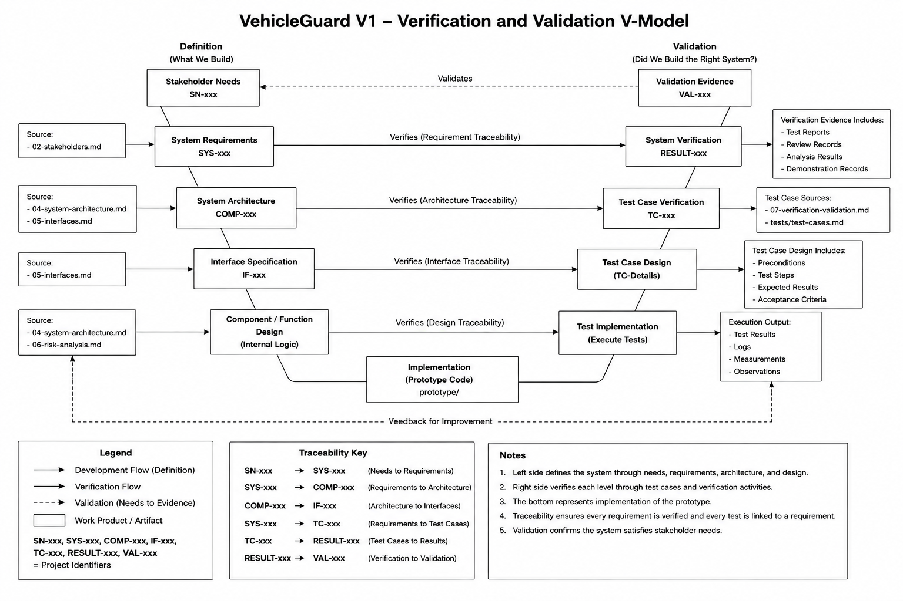

# VehicleGuard Verification and Validation

## 1. Purpose

This document defines the verification and validation approach for VehicleGuard V1.

The purpose of Verification and Validation (V&V) is to provide structured evidence that:

- VehicleGuard has been developed according to its defined system requirements;
- architecture and interfaces support the required system behaviour;
- implemented diagnostic functions behave as specified;
- identified failure scenarios are considered during testing;
- system behaviour remains consistent with the identified stakeholder needs.

Verification and validation are treated as related but different engineering activities.

Verification asks:

> Did we build the system correctly?

Validation asks:

> Did we build the right system?

VehicleGuard V1 uses requirements traceability, requirement-based testing, interface checks, boundary testing, failure-oriented testing, and documented verification evidence to support these activities.

---

## 2. Scope

The V&V approach covers the VehicleGuard V1 engineering artifacts and prototype.

The main items considered are:

- stakeholder needs;
- system requirements;
- system architecture;
- interface definitions;
- configuration data;
- prototype implementation;
- diagnostic behaviour;
- severity classification;
- driver warning generation;
- diagnostic event generation;
- identified technical failure scenarios.

The V&V activities described in this document are intended for the VehicleGuard engineering prototype.

They do not represent production vehicle homologation, certification, or a complete functional safety validation process.

---

## 3. Verification and Validation Model

VehicleGuard follows a simplified V-model approach.

The left side of the model defines the system.

The bottom represents prototype implementation.

The right side represents verification and validation activities used to provide evidence that the implemented system satisfies its defined engineering artifacts.



<p align="center">
  <em>Figure 1 - VehicleGuard V1 Verification and Validation V-Model</em>
</p>

The general relationship is:

```text
Definition
    |
    v
Implementation
    |
    v
Verification
    |
    v
Validation
```

Traceability is maintained between the artifacts on both sides of the model.

---

## 4. Verification

Verification determines whether an engineering artifact or implemented function satisfies its specified requirements.

For VehicleGuard, verification focuses primarily on the `SYS-xxx` system requirements.

A typical verification chain is:

```text
SYS-xxx
   |
   v
Verification Method
   |
   v
TC-xxx
   |
   v
Test Execution
   |
   v
RESULT-xxx
   |
   v
PASS / FAIL
```

A requirement is not considered verified only because the corresponding functionality exists in the prototype.

Verification requires objective evidence.

---

## 5. Validation

Validation evaluates whether the resulting VehicleGuard behaviour addresses the intended stakeholder needs and project purpose.

The validation relationship is:

```text
SN-xxx
   |
   v
System Behaviour
   |
   v
Validation Assessment
   |
   v
VAL-xxx
```

Validation therefore considers the system from the stakeholder perspective rather than checking only individual technical requirements.

Examples include determining whether:

- abnormal vehicle conditions result in understandable driver information;
- diagnostic information contains useful technical information;
- invalid data remains distinguishable from a real vehicle condition;
- configuration can be changed without redesigning diagnostic processing logic;
- the prototype demonstrates the intended VehicleGuard concept.

Validation evidence will be produced after the required prototype functionality has been implemented and verified.

---

## 6. Verification Methods

VehicleGuard uses the following verification methods.

### 6.1 Test

**Identifier**

`T`

Test is the primary verification method for behavioural system requirements.

A controlled input is provided to the prototype and the observed output is compared with the expected result.

Examples include:

- providing a valid coolant temperature and checking the resulting condition;
- providing an invalid battery voltage and checking validation behaviour;
- triggering a configured abnormal condition;
- checking severity classification;
- checking generated warning information;
- checking diagnostic event contents.

---

### 6.2 Inspection

**Identifier**

`I`

Inspection is used when compliance can be established by reviewing an engineering artifact, configuration, interface definition, or implementation structure without executing a behavioural test.

Examples include:

- confirming that configuration values are stored separately from diagnostic processing logic;
- checking that required interface fields are defined;
- confirming that requirement identifiers are present and unique;
- reviewing output structures for required fields.

---

### 6.3 Analysis

**Identifier**

`A`

Analysis is used when compliance is determined through engineering reasoning or evaluation of available technical information.

Examples include:

- evaluating traceability completeness;
- reviewing architecture allocation;
- analysing identified failure scenarios;
- assessing whether system decomposition supports the required behaviour.

Analysis should produce a documented conclusion rather than an unsupported statement.

---

### 6.4 Demonstration

**Identifier**

`D`

Demonstration is used to show observable VehicleGuard behaviour under representative operating scenarios.

Examples include:

- demonstrating the transition from normal operation to a warning condition;
- demonstrating simultaneous abnormal conditions;
- demonstrating recovery from an abnormal condition;
- demonstrating generation of driver and diagnostic outputs.

Demonstration may support validation but does not replace requirement-specific verification where a formal test is required.

---

## 7. Verification Method Selection

Each system requirement is assigned at least one appropriate verification method.

The method is selected according to the type of requirement.

| Requirement Type | Preferred Method |
|---|---|
| Input behaviour | Test |
| Input validation | Test |
| Monitoring behaviour | Test |
| Diagnostic behaviour | Test |
| Severity classification | Test |
| Driver warning behaviour | Test / Inspection |
| Diagnostic event behaviour | Test |
| Configuration separation | Inspection / Test |
| Architecture consistency | Inspection / Analysis |
| Traceability completeness | Inspection / Analysis |

A requirement may use more than one method where necessary.

The detailed method assignment is maintained in:

`requirements/requirements.xlsx`

---

## 8. Verification Levels

VehicleGuard verification is organized across several engineering levels.

### 8.1 Requirements Verification

Requirements are reviewed to determine whether they are:

- understandable;
- specific;
- internally consistent;
- feasible within the V1 scope;
- traceable to a source;
- verifiable.

Requirements that cannot be objectively verified should be refined before baseline establishment.

---

### 8.2 Architecture Verification

The architecture is reviewed against the system requirements.

The review checks whether:

- every major system responsibility is represented;
- architecture elements have defined responsibilities;
- requirements are allocated to appropriate architecture elements;
- interfaces exist where information must be exchanged;
- architecture elements do not introduce unnecessary V1 functionality.

Architecture verification primarily uses inspection and analysis.

---

### 8.3 Interface Verification

Interfaces are checked against the architecture and requirements.

Verification includes:

- required fields;
- data types;
- engineering units;
- supported input ranges;
- interface direction;
- information ownership;
- invalid data handling;
- output information.

Interface behaviour that can be executed through the prototype is additionally verified by testing.

---

### 8.4 Component and Function Verification

Prototype functions representing VehicleGuard architecture responsibilities are tested using controlled input data.

The objective is to verify individual behaviours before relying on complete system scenarios.

Examples include:

- input validation;
- parameter monitoring;
- condition detection;
- severity classification;
- warning generation;
- diagnostic event generation.

---

### 8.5 System Verification

System verification evaluates the integrated VehicleGuard processing chain.

A complete test may exercise:

```text
VehicleData
     |
     v
Input
     |
     v
Validation
     |
     v
Monitoring
     |
     v
Diagnostics
     |
     v
Severity
     |
     +----------------+
     |                |
     v                v
Warning            Event
```

The observed result is compared with the expected system behaviour derived from the applicable requirements.

---

## 9. Test Case Identification

VehicleGuard test cases use the identifier format:

```text
TC-<CATEGORY>-XXX
```

Examples:

```text
TC-INP-001
TC-VAL-001
TC-MON-001
TC-DIAG-001
TC-SEV-001
TC-WRN-001
TC-EVT-001
TC-CFG-001
```

The category identifies the primary system area being tested.

Test case identifiers must remain unique.

An existing identifier should not be reused for an unrelated test case.

---

## 10. Test Case Structure

Each test case should contain enough information for another person to understand what is being verified and how the result is determined.

The standard VehicleGuard test case structure is:

```text
Test Case ID
Title
Related Requirement(s)
Related Architecture Element
Objective
Preconditions
Input Data
Test Steps
Expected Result
Acceptance Criteria
Actual Result
Status
Evidence Reference
```

The detailed test cases will be maintained in:

`tests/test-cases.md`

---

## 11. Test Preconditions

A test case may define preconditions required before execution.

Examples include:

- a specific VehicleGuard configuration is active;
- the prototype starts in a known state;
- a required input structure is available;
- previous diagnostic state is cleared;
- a defined parameter threshold is configured.

Preconditions should be explicit where they affect the expected result.

---

## 12. Test Inputs

Test inputs must be controlled and reproducible.

VehicleGuard V1 test data may include:

- manually defined vehicle data samples;
- predefined simulator scenarios;
- configuration values;
- invalid data samples;
- boundary values;
- sequences of vehicle data samples.

The input used for a test should be documented sufficiently to allow the test to be repeated.

---

## 13. Expected Results

Each executable test case must define an expected result before the final test result is evaluated.

Expected results are derived from:

- system requirements;
- interface definitions;
- active configuration;
- defined system behaviour.

An expected result should be specific enough to determine whether the test passed or failed.

For example:

```text
Input:
coolant_temperature = configured WARNING boundary

Expected:
Condition is detected according to the active configuration.
Assigned severity = WARNING.
Required diagnostic event is generated.
Driver warning is generated where required.
```

The actual numerical demonstration threshold is taken from the active test configuration.

---

## 14. Acceptance Criteria

A test case passes when the observed behaviour satisfies all defined acceptance criteria.

Possible acceptance criteria include:

- expected condition detected;
- expected condition not detected;
- correct severity assigned;
- invalid data rejected;
- correct parameter identified;
- required output generated;
- required output field present;
- observed value reported correctly;
- timestamp preserved;
- no prohibited warning generated.

Acceptance criteria should avoid subjective terms such as:

```text
works correctly
looks good
behaves normally
```

unless the expected behaviour is further defined.

---

## 15. Boundary Value Testing

Boundary testing is particularly important for VehicleGuard because several behaviours depend on configured numeric criteria.

For a threshold `X`, test values should normally include:

```text
X - Δ
X
X + Δ
```

where `Δ` is a suitable small change for the parameter being tested.

For supported input ranges, testing should include:

```text
minimum - Δ
minimum
minimum + Δ

maximum - Δ
maximum
maximum + Δ
```

This helps detect incorrect comparison operators and boundary handling.

Boundary tests are particularly relevant to:

- `COMP-VAL-001`;
- `COMP-MON-001`;
- `COMP-DIAG-001`;
- `COMP-SEV-001`.

---

## 16. Invalid Input Testing

Invalid input tests verify that incorrect input data does not enter normal diagnostic processing as valid vehicle information.

Test conditions should include:

- missing required parameter;
- incorrect data type;
- value below supported range;
- value above supported range;
- malformed input structure where applicable.

Expected behaviour should confirm that:

- the invalid input is detected;
- the invalid value is not treated as a valid operating value;
- the invalid input remains distinguishable from a genuine abnormal vehicle condition;
- diagnostic information is generated where required.

These tests directly support the failure analysis defined for `SCN-01` and `SCN-03`.

---

## 17. Diagnostic Threshold Testing

Diagnostic threshold tests verify the transition between configured operating conditions.

For each monitored parameter, tests should cover applicable transitions such as:

```text
NORMAL -> INFO
NORMAL -> WARNING
WARNING -> CRITICAL
ABNORMAL -> NORMAL
```

Only transitions supported by the active configuration need to be tested.

The test definition must identify the configuration used during execution.

---

## 18. Multiple Condition Testing

VehicleGuard supports detection of multiple abnormal conditions within the same vehicle data sample.

Verification must therefore include at least one scenario where multiple parameters simultaneously satisfy abnormal condition criteria.

The test should confirm that each condition receives its own:

- parameter identification;
- condition identifier;
- severity classification;
- diagnostic event;
- driver warning where required.

One detected condition must not prevent another valid condition from being processed.

---

## 19. Recovery Testing

VehicleGuard must recognize when a previously abnormal monitored parameter returns to its configured normal operating condition.

A recovery test should include a sequence such as:

```text
Normal Value
     |
     v
Abnormal Value
     |
     v
Normal Value
```

The test should confirm that the system does not continue reporting the previous abnormal state as active after the recovery condition has been correctly processed.

---

## 20. Configuration Testing

Configuration testing verifies that diagnostic behaviour is controlled by the active configuration.

Tests should confirm that:

- parameter-specific configuration is applied correctly;
- supported input ranges are used by validation;
- monitoring criteria are used by diagnostic processing;
- severity criteria are used by severity classification;
- configuration for one parameter does not incorrectly affect another parameter;
- changing a configurable threshold changes the relevant behaviour without requiring a change to the diagnostic processing logic.

VehicleGuard demonstration values must not be interpreted as universal production vehicle thresholds.

---

## 21. Driver Warning Verification

Driver warning verification focuses on `COMP-WRN-001`.

Tests should verify that warning information contains the required information and is generated under the required conditions.

Verification includes:

- affected parameter;
- severity level;
- driver-oriented message;
- correct association with the detected condition;
- absence of an active abnormal-condition warning for a `NORMAL` condition.

The test does not evaluate production instrument cluster graphics because a production HMI is outside the VehicleGuard V1 scope.

---

## 22. Diagnostic Event Verification

Diagnostic event verification focuses on `COMP-EVT-001`.

Tests should verify the required event information, including:

- condition identifier;
- affected parameter;
- observed value where available;
- severity level;
- timestamp;
- event type where applicable.

Invalid input diagnostic information should also be tested separately from normal vehicle fault events.

---

## 23. Failure-Oriented Testing

The technical failure scenarios identified in `06-risk-analysis.md` are used as input to verification planning.

The relationship is:

```text
SCN-xx
   |
   v
Related SYS-xxx
   |
   v
Related COMP-xxx
   |
   v
TC-xxx
```

The initial failure scenarios include:

| Scenario | Verification Focus |
|---|---|
| `SCN-01` | Invalid input detection |
| `SCN-02` | Configuration correctness |
| `SCN-03` | Validation logic |
| `SCN-04` | Monitoring and diagnostic logic |
| `SCN-05` | Severity classification |
| `SCN-06` | Output generation |

This ensures that identified failure scenarios influence actual verification activities.

---

## 24. Verification Evidence

Successful test execution must produce objective evidence.

VehicleGuard verification evidence may include:

- automated test results;
- test execution logs;
- structured result files;
- recorded expected and actual values;
- review records;
- analysis results;
- test report entries.

Verification evidence uses the identifier format:

```text
RESULT-XXX
```

or a more specific project convention if required during test implementation.

Each evidence item should remain traceable to the applicable test case.

---

## 25. Test Result Status

Each executed test case receives one of the following statuses.

### PASS

The observed result satisfies all defined acceptance criteria.

### FAIL

One or more acceptance criteria are not satisfied.

### BLOCKED

The test cannot currently be completed because a required dependency, implementation, configuration, or test condition is unavailable.

### NOT RUN

The test case has been defined but has not yet been executed.

A test must not be marked `PASS` without corresponding execution evidence.

---

## 26. Failure Handling and Re-Test

A failed test does not automatically mean that the requirement itself is incorrect.

A failure may originate from:

- requirement ambiguity;
- architecture error;
- interface error;
- incorrect configuration;
- implementation defect;
- incorrect test definition;
- incorrect expected result.

The failure should therefore be analysed before corrective action is selected.

The general process is:

```text
Test Execution
      |
      v
FAIL
      |
      v
Failure Analysis
      |
      v
Identify Affected Artifact
      |
      +-> Requirement
      |
      +-> Architecture
      |
      +-> Interface
      |
      +-> Configuration
      |
      +-> Implementation
      |
      +-> Test Case
      |
      v
Corrective Action
      |
      v
Re-Test
```

If corrective action changes a baselined engineering artifact, the change management process should be followed.

---

## 27. Requirements Verification Matrix

The Requirements Verification Matrix provides the structured relationship between requirements and verification activities.

The matrix is maintained in:

`requirements/requirements.xlsx`

The intended structure includes:

| Field | Purpose |
|---|---|
| Requirement ID | Requirement being verified |
| Verification Method | Test, Inspection, Analysis, or Demonstration |
| Test Case ID | Associated test case |
| Architecture Element | Responsible architecture element |
| Expected Evidence | Evidence expected from verification |
| Result ID | Verification evidence identifier |
| Verification Status | Current verification state |
| Comments | Additional engineering information |

During early project stages, fields related to test execution may remain `TBD` or `NOT RUN`.

They are completed as test cases and evidence become available.

---

## 28. Traceability

VehicleGuard V&V maintains bidirectional traceability.

The complete intended chain is:

```text
SN-xxx
   |
   v
SYS-xxx
   |
   v
COMP-xxx
   |
   v
IF-xxx
   |
   v
TC-xxx
   |
   v
RESULT-xxx
   |
   v
VAL-xxx
```

Forward traceability makes it possible to determine how a stakeholder need is implemented and verified.

Backward traceability makes it possible to determine why a test case, architecture element, or requirement exists.

Traceability information is maintained primarily in:

`requirements/requirements.xlsx`

---

## 29. Verification Coverage

Verification coverage describes how completely the defined system requirements are addressed by verification activities.

The basic requirement coverage metric is:

```text
Requirements with Defined Verification
-------------------------------------- x 100%
Total Applicable Requirements
```

After test execution, verified requirement coverage can be evaluated as:

```text
Requirements with Satisfactory Evidence
--------------------------------------- x 100%
Total Applicable Requirements
```

Coverage values should be calculated from the structured requirements and verification data rather than estimated manually.

A high coverage percentage alone does not prove system correctness.

The quality of the requirements, test cases, acceptance criteria, and evidence must also be considered.

---

## 30. Validation Approach

VehicleGuard validation will be performed after sufficient system functionality has been implemented and verified.

Validation will use representative end-to-end scenarios derived from stakeholder needs.

Example validation scenarios may include:

- driver receives understandable information for an abnormal vehicle condition;
- service-oriented diagnostic information identifies the affected parameter and condition;
- invalid input is distinguishable from a real vehicle problem;
- multiple abnormal conditions can be represented independently;
- configuration changes can alter demonstration diagnostic criteria without redesigning the system.

Validation results will use identifiers such as:

```text
VAL-001
VAL-002
VAL-003
```

The final set of validation activities will be defined after the prototype and verification test set are available.

---

## 31. Validation Acceptance

A stakeholder need may be considered supported when:

- the related system requirements have been identified;
- the required system behaviour is implemented;
- applicable system requirements have satisfactory verification evidence;
- representative system behaviour has been assessed against the stakeholder need;
- no unresolved failure prevents the intended need from being demonstrated.

Validation does not require VehicleGuard V1 to represent a production-ready automotive system.

It evaluates the system against the defined scope and stakeholder needs of this project.

---

## 32. V&V Limitations

The VehicleGuard V1 verification and validation process is designed for an engineering prototype.

It does not currently include:

- production vehicle testing;
- hardware-in-the-loop testing;
- vehicle-in-the-loop testing;
- road testing;
- environmental qualification;
- electromagnetic compatibility testing;
- production ECU timing verification;
- formal safety validation;
- cybersecurity penetration testing;
- homologation testing.

These activities would require hardware, vehicle integration, production requirements, or organizational processes outside the scope of VehicleGuard V1.

---

## 33. V&V Completion Criteria

VehicleGuard V1 verification may be considered complete for the defined prototype scope when:

- applicable system requirements have assigned verification methods;
- required test cases have been defined;
- planned executable tests have been run;
- verification evidence has been recorded;
- failed tests have been resolved or formally documented;
- requirement verification status is traceable;
- identified technical failure scenarios have appropriate verification coverage.

Validation may be considered complete when the implemented and verified system behaviour has been assessed against the applicable stakeholder needs.

Any remaining limitations must be documented.

---

## 34. Current V&V Status

The current VehicleGuard V1 V&V status is:

`Planning - Test Definition Pending`

At the current project stage:

- stakeholder needs have been defined;
- system requirements have been defined;
- the initial system architecture has been defined;
- logical interfaces have been defined;
- initial technical failure scenarios have been identified;
- the V&V strategy has been defined;
- detailed test cases have not yet been completed;
- prototype verification has not yet been executed;
- verification evidence has not yet been produced;
- final validation has not yet been performed.

The next V&V activity is the development of requirement-based test cases and the completion of the Requirements Verification Matrix.

No VehicleGuard V1 requirement should be marked as verified until the required verification activity has been completed and corresponding evidence is available.
